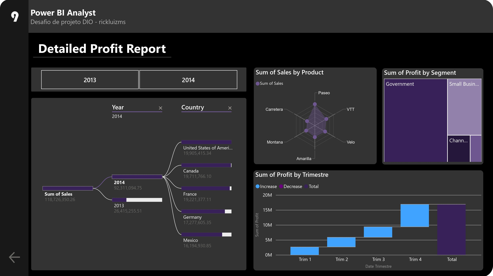

# dio-dashboard-desafio01
Desafio de projeto - Dashboard financeiro com Power Bi

## Descrição do projeto

Este projeto foi desenvolvido durante as aulas do bootcamp "Santander Bootcamp 2023 - Ciência de Dados com Python", da Digital Innovation One - DIO, no módulo de "Visualização e Analise de dados com Power Bi".

## Dashboard

